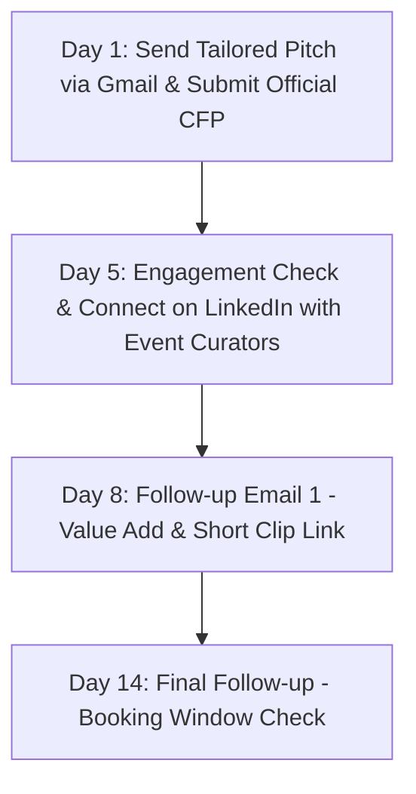

# 🎙️ Lornette Daye | AI Keynote Speaker Dossier & Global Outreach Master Plan

> **Speaker Profile:** [Lornette Daye Official Website](https://lornettedaye.com)  
> **Core Theme:** *"From Champion Athlete to AI-Powered Founder: Building High-Impact Ventures, Everyday Productivity, and Resilient Leadership with AI"*  
> **Key Narrative:** Merging 40+ years of elite athletic discipline (former Canadian record holder) and transformational executive coaching with real-world AI tool adoption used to scale **UMATTR** and master daily productivity without burnout.

---

## 📑 Master Navigation Index
1. [Speaker One-Sheet & Keynote Bio Abstracts](#1-speaker-one-sheet--keynote-abstracts)
2. [Top 10 Priority Opportunities & Tailored Gmail Pitches](#2-top-10-priority-opportunities--tailored-gmail-pitches)
3. [Full 20-Opportunity CRM Tracker (Notion-Ready Database Schema)](#3-full-20-opportunity-crm-tracker)
4. [Follow-Up & Booking Workflow Sequence](#4-outreach-follow-up-sequence--best-practices)

---

# 1. Speaker One-Sheet & Keynote Abstracts

### 👤 Speaker Biography (Short & Mainstage)
**Lornette Daye** is a Canadian record-holding sprint athlete, executive coach, author, and the founder of **UMATTR**. Bringing four decades of elite sport discipline, international competition, and lived resilience to the stage, Lornette demystifies modern artificial intelligence for leaders, founders, and professionals. Through her work building UMATTR into an AI-augmented venture and architecting seamless personal AI workflows, she teaches audiences how to harness AI as an exponential operational leverage point while safeguarding human empathy, purpose, and mental resilience.

### 🌟 Signature AI Keynote Abstracts

#### 🔹 Keynote 1: *From Champion Athlete to AI-Powered Founder: Building High-Impact Ventures with Generative AI*
* **Audience:** Tech founders, corporate innovators, executive leaders, Women-in-Tech summit attendees.
* **Abstract:** What does it take to move from breaking national sprint records to building an AI-enabled enterprise? In this high-energy, actionable keynote, Lornette Daye unpacks how elite athletic discipline translates directly into modern technology leadership. Audiences discover the exact AI frameworks, agentic workflows, and lean execution models she utilized to build UMATTR. Lornette strips away technical jargon to show founders how to multiply output, automate operations, and outpace competition using accessible AI tools.
* **Key Takeaways:**
  * The Athlete-Founder Mindset: Resilience, speed of iteration, and focus in the age of rapid AI acceleration.
  * The UMATTR AI Blueprint: Real-world case study on using AI agents and tools to scale venture operations leanly.
  * Overcoming the AI Adoption Gap: Practical strategies for women and underrepresented founders to lead in tech.

#### 🔹 Keynote 2: *The AI-Augmented Life: Reclaiming Time, Peak Performance, and Burnout-Free Productivity*
* **Audience:** Corporate executives, leadership retreats, wellness & tech conferences, working professionals.
* **Abstract:** Technology should empower human potential, not accelerate burnout. Drawing from 40+ years of performance coaching and everyday AI experimentation, Lornette reveals how everyday professionals can integrate AI into their personal lives and daily routines. From executive cognitive load reduction to automated scheduling, task synthesis, and lifestyle optimization, this keynote gives attendees an immediately applicable roadmap to reclaim 10+ hours a week and operate at peak capacity.
* **Key Takeaways:**
  * Reclaiming Cognitive Bandwidth: Designing customized daily AI assistants for personal and professional tasks.
  * High Performance Without Exhaustion: Establishing healthy boundaries and sustainable energy habits using AI.
  * Human-First Technology: Preserving identity, intuition, and emotional intelligence in an automated world.

---

# 2. Top 10 Priority Opportunities & Tailored Gmail Pitches

Below are the **Top 10 High-Priority Global Opportunities** with verified contact emails, CFP submission portals, and copy-paste-ready Gmail pitch drafts tailored to each event's specific mission.

---

### Opportunity #1: AFROTECH™ Conference (Blavity Inc.)
* **Focus:** Black tech innovators, founders, engineers, and executive leaders.
* **Dates / Location:** November | Houston, TX & Hybrid Global Access
* **Portal / CFP:** [afrotech.com](https://afrotech.com/)
* **Direct Contacts:** `events@blavity.com` | `afrotech@blavity.com`

```email
Subject: Keynote Pitch: From Champion Athlete to AI-Powered Founder (Lornette Daye for AfroTech)

Hi AfroTech Programming Team,

AfroTech continues to set the benchmark for Black innovation, leadership, and venture building. I am writing to pitch Lornette Daye as a dynamic, high-impact keynote speaker for this year's Innovation & Founder stages.

Lornette is a former Canadian national record-holding sprinter, executive coach, author, and the founder of UMATTR (https://lornettedaye.com). 

In her keynote, "From Champion Athlete to AI-Powered Founder: Building High-Impact Ventures with Generative AI," Lornette bridges four decades of elite athletic discipline with practical, real-world AI deployment. She shares how she leveraged AI tools and agentic workflows to build and scale UMATTR, providing underrepresented founders with an actionable playbook to multiply output, eliminate operational bottlenecks, and lead in tech.

Key Session Highlights:
• The Athletic Mindset in Tech: Speed of iteration, mental resilience, and executing in high-pressure environments.
• The UMATTR Case Study: Concrete AI workflows used to scale business operations and product development.
• Closing the AI Gap: Empowering founders with non-technical backgrounds to harness modern AI tools immediately.

Lornette’s speaker reel, credentials, and full bio are available at https://lornettedaye.com and https://lornettedaye.com/media.

Would you be open to a brief 10-minute conversation to explore fitting this session into your upcoming stage programming?

Warm regards,

Lornette Daye Team
contact@lornettedaye.com | https://lornettedaye.com
```

---

### Opportunity #2: Grace Hopper Celebration (GHC - AnitaB.org)
* **Focus:** World’s largest annual gathering of women and non-binary technologists.
* **Dates / Location:** Fall (September/October) | US Flagship City & Virtual Broadcast
* **Portal / CFP:** [ghc.anitab.org](https://ghc.anitab.org/)
* **Direct Contacts:** `ghcspeakers@anitab.org` | `support@anitab.org`

```email
Subject: GHC Speaker Submission: Lornette Daye on Resilient Leadership & AI Venture Building

Dear AnitaB.org & GHC Content Review Committee,

As you curate world-class voices for the upcoming Grace Hopper Celebration, I would like to submit Lornette Daye for your Leadership & Emerging Tech / AI tracks.

Lornette is a former Canadian record-holding track athlete, leadership coach, and founder of UMATTR (https://lornettedaye.com). She brings an authentic, electrifying perspective on how women technologists and founders can harness artificial intelligence to accelerate venture creation while maintaining human-centric resilience.

Proposed Keynote Topic:
"The AI-Augmented Leader: Champion Discipline, AI Workflows, and Sustainable Innovation"

What Attendees Will Learn:
1. Operational Leverage Through AI: How Lornette built UMATTR using modern AI architectures and daily agentic workflows.
2. The Resilient Technologist: Navigating tech disruption, pressure, and career pivots using elite athletic mental frameworks.
3. Everyday AI Mastery: Demystifying AI tools for daily productivity, decision-making, and burnout prevention.

Speaker profile, videos, and media kit: https://lornettedaye.com/media

Thank you for your review. We look forward to the possibility of inspiring thousands of women technologists on the GHC stage.

Best regards,

Lornette Daye Team
contact@lornettedaye.com | https://lornettedaye.com
```

---

### Opportunity #3: Elevate Festival (Toronto, Canada)
* **Focus:** Canada’s premier tech, AI, and innovation festival.
* **Dates / Location:** October | Toronto, ON, Canada
* **Portal / CFP:** [elevatefestival.ca](https://elevatefestival.ca/)
* **Direct Contacts:** `speakers@elevate.ca` | `hello@elevate.ca`

```email
Subject: Speaker Submission for Elevate: Canadian Record Holder & AI Founder Lornette Daye

Hi Elevate Curation Team,

Elevate is renowned for championing Canadian innovation at the intersection of technology, culture, and social impact. We are excited to propose Lornette Daye for your Applied AI & Leadership stages.

Lornette holds an iconic place in Canadian sport history (setting a national 100m sprint standard that stood for 28 years) and has spent four decades coaching leaders and mentoring high performers. Today, as founder of UMATTR, she actively champions practical AI adoption for founders and everyday professionals.

Proposed Talk:
"From Champion Athlete to AI-Powered Founder: Building High-Impact Ventures & Daily Productivity with AI"

Session Takeaways:
• Canadian Excellence & Tech Agility: How the championship discipline that built national records drives high-speed AI venture creation.
• The Applied AI Playbook: How Lornette utilizes AI tools inside UMATTR to automate operations and maximize scale.
• Human-First AI: Reclaiming time, mastering personal AI workflows, and sustaining executive wellness.

Watch Lornette in action: https://lornettedaye.com/media

We would welcome the opportunity to discuss hosting Lornette on stage in Toronto this October.

Warmly,

Lornette Daye Team
contact@lornettedaye.com | https://lornettedaye.com
```

---

### Opportunity #4: European Women in Technology (Amsterdam)
* **Focus:** Europe's largest summit for women in tech, founders, and C-suite leaders.
* **Dates / Location:** June | RAI Amsterdam, Netherlands & Virtual
* **Portal / CFP:** [women-in-technology.com/call-for-speakers](https://women-in-technology.com/call-for-speakers)
* **Direct Contacts:** `speakers@maddoxevents.com` | `info@maddoxevents.com`

```email
Subject: Speaker Proposal: Lornette Daye at European Women in Tech Amsterdam

Dear European Women in Technology Programming Committee,

I am writing to propose Lornette Daye for a keynote session at European Women in Technology in Amsterdam.

Lornette is an acclaimed transformational speaker, executive coach, author, and tech entrepreneur (Founder of UMATTR, https://lornettedaye.com). With a background as an elite international sprinter, Lornette uniquely combines high-performance sports psychology with practical AI entrepreneurship.

Keynote Abstract:
"The AI-Augmented Executive: Scaling High-Impact Ventures and Daily Life with AI"

Key Themes:
• Demystifying AI for Founders: Moving beyond theory into hands-on workflows that automate business operations and scale ventures leanly.
• Mental Resilience Under Disruption: Athletic principles for leading through technological turbulence and AI acceleration.
• The Everyday AI OS: Actionable workflows to regain 10+ hours a week and avoid executive burnout.

Full Speaker Profile & Reel: https://lornettedaye.com

We would be delighted to collaborate on delivering an unforgettable session for your European audience.

Sincerely,

Lornette Daye Team
contact@lornettedaye.com | https://lornettedaye.com
```

---

### Opportunity #5: Women in Tech® Global Summit (Paris & Worldwide)
* **Focus:** Global movement dedicated to closing the gender gap in STEAM and tech entrepreneurship.
* **Dates / Location:** Annual Global Flagship in Paris, France & Virtual
* **Portal / CFP:** [women-in-tech.org/become-a-speaker/](https://women-in-tech.org/become-a-speaker/)
* **Direct Contacts:** `contact@women-in-tech.org`

```email
Subject: Keynote Speaker Submission: Lornette Daye for Women in Tech Global Summit Paris

Dear Women in Tech® Global Team,

Your global mission to empower 5 million women in STEAM by 2030 is truly transformative. We would love to submit Lornette Daye to deliver a keynote at your upcoming Global Summit in Paris.

Lornette Daye is an elite former athlete, transformational speaker, and founder of UMATTR (https://lornettedaye.com). Her work is focused on making artificial intelligence accessible and actionable for female founders and professionals worldwide.

Keynote Title:
"From Champion Athlete to AI-Powered Founder: Leading the Next Era of Inclusive Tech"

Key Takeaways:
1. Athletic Resilience meets AI Innovation: How female leaders can harness AI tools to build scalable businesses without technical barriers.
2. Real-World AI Implementation: Practical case studies from UMATTR on deploying AI for marketing, operations, and community engagement.
3. Daily AI Workflows: Using AI to optimize personal productivity, energy management, and career balance.

Explore Lornette’s keynote reel and portfolio: https://lornettedaye.com/media

Thank you for your consideration, and we look forward to connecting with your curation team.

Kind regards,

Lornette Daye Team
contact@lornettedaye.com | https://lornettedaye.com
```

---

### Opportunity #6: Fast Company Innovation Festival
* **Focus:** World-class visionaries, creative entrepreneurs, and business transformers.
* **Dates / Location:** September | New York City, NY & Virtual
* **Portal / CFP:** [events.fastcompany.com](https://events.fastcompany.com)
* **Direct Contacts:** `events@fastcompany.com`

```email
Subject: Speaker Pitch: AI-Powered Venture Building with Lornette Daye (Fast Company Innovation Festival)

Hi Fast Company Events Team,

The Fast Company Innovation Festival always showcases bold thinkers who redefine work and leadership. I am thrilled to pitch Lornette Daye for this year's festival.

Lornette is an elite sprint champion, executive coach, and founder of UMATTR (https://lornettedaye.com), who has pioneered practical, accessible AI integration for modern venture building and personal peak performance.

Proposed Session:
"The AI-Augmented Founder: Championship Mindset and the Future of Lean Venture Building"

Session Focus:
• Fast Execution with AI: How Lornette built UMATTR by leveraging AI agents and automation as core team multipliers.
• Cognitive Agility in the AI Era: Parallels between world-class athletic training and leading an organization through rapid tech evolution.
• The Reclaimed Week: Hands-on AI systems that eliminate operational drag and protect creative time.

Speaker Videos & Press Kit: https://lornettedaye.com/media

Let’s connect to see how Lornette can bring an energetic, actionable keynote to the Fast Company stage.

Best regards,

Lornette Daye Team
contact@lornettedaye.com | https://lornettedaye.com
```

---

### Opportunity #7: Fortune Most Powerful Women (MPW) Summit & NextGen
* **Focus:** Premier C-suite executives, visionary founders, and emerging women leaders.
* **Dates / Location:** October / November | Laguna Niguel, CA
* **Portal / CFP:** [fortune.com/conferences](https://fortune.com/conferences/most-powerful-women-summit/)
* **Direct Contacts:** `mostpowerfulwomen@fortune.com`

```email
Subject: Speaker Nomination: Lornette Daye on Executive AI Adoption & Resilient Leadership

Dear Fortune Most Powerful Women Programming Team,

I am writing to nominate Lornette Daye for the Fortune Most Powerful Women Summit / MPW NextGen.

Lornette is a renowned executive coach, author, former national record-holding sprinter, and founder of UMATTR (https://lornettedaye.com). She delivers transformative insights on how top female executives can leverage artificial intelligence to multiply their leadership impact and streamline daily operations.

Keynote Abstract:
"Executive Endurance: Leading AI Transformation and Sustainable High Performance"

Key Discussion Points:
• Strategic AI Leverage: How executive leaders can operationalize AI across business workflows without losing the human touch.
• Resilient C-Suite Leadership: 40 years of elite athletic coaching applied to managing high-stakes corporate decisions.
• Time Mastery: How AI workflows help executives eliminate cognitive fatigue and lead with greater clarity.

Review Lornette’s keynote background: https://lornettedaye.com

We would be thrilled to discuss fitting Lornette into an upcoming MPW keynote or panel conversation.

Warm regards,

Lornette Daye Team
contact@lornettedaye.com | https://lornettedaye.com
```

---

### Opportunity #8: WomenTech Global Conference & Chief in Tech Summit
* **Focus:** 100,000+ global technologists, female executives, and innovators.
* **Dates / Location:** May (Flagship) & Quarterly Series | Global Virtual / Hybrid
* **Portal / CFP:** [womentech.net/apply-to-speak](https://www.womentech.net/apply-to-speak)
* **Direct Contacts:** `speakers@womentech.net` | `office@womentech.net`

```email
Subject: WTGC Speaker Proposal: From Champion Athlete to AI-Powered Founder (Lornette Daye)

Dear WomenTech Network Curation Committee,

I would like to submit Lornette Daye as a keynote speaker for the WomenTech Global Conference and the Chief in Tech Summit.

Lornette Daye is a Canadian sprint record holder, executive leadership coach, and founder of UMATTR (https://lornettedaye.com). Her keynote delivers an empowering blend of high-performance psychology and practical AI workflows.

Proposed Talk:
"From Champion Athlete to AI-Powered Founder: Building High-Impact Ventures, Everyday Productivity, and Resilient Leadership with AI"

Key Takeaways for Attendees:
• Building Lean with AI: Practical breakdown of how UMATTR uses AI tools to achieve outsized business results.
• Overcoming Fear of Tech Disruption: Empowering non-technical and executive women to embrace AI tools confidently.
• AI in Daily Life: Building daily personal AI workflows that preserve work-life harmony and prevent burnout.

Speaker video & bio: https://lornettedaye.com/media

Thank you for your work uniting women in tech across the globe.

Best regards,

Lornette Daye Team
contact@lornettedaye.com | https://lornettedaye.com
```

---

### Opportunity #9: Women in AI (WAI) Global Summit
* **Focus:** Global community dedicated to women building, researching, and applying AI.
* **Dates / Location:** Annual Global & European Chapter Summits | Paris, Berlin & Virtual
* **Portal / CFP:** [womeninaiglobalsummit.com/apply-to-speak](https://womeninaiglobalsummit.com/apply-to-speak)
* **Direct Contacts:** `waisummit@womeninai.co` | `speakers@womeninai.co`

```email
Subject: Keynote Pitch: Applied AI for Founders & Everyday Productivity with Lornette Daye

Dear Women in AI (WAI) Programming Team,

As Women in AI continues to spearhead inclusive and ethical artificial intelligence, we would love to propose Lornette Daye as a featured speaker for your upcoming summit.

Lornette is the founder of UMATTR (https://lornettedaye.com), an executive coach, and a former Canadian national record-holding athlete. Her keynote focuses directly on Applied AI for entrepreneurship, lifestyle optimization, and leadership resilience.

Session Abstract:
"Applied AI for Everyday Founders: Moving from Theory to Real-World Impact"

Session Highlights:
• The Solo/Small Team AI Advantage: How UMATTR uses AI systems for continuous product iteration and brand building.
• Daily AI Utility: Practical frameworks for using AI to manage executive focus, health, and task automation.
• Inclusive Leadership: Breaking down intimidation barriers around generative AI for female entrepreneurs.

Speaker reel and materials: https://lornettedaye.com

We look forward to collaborating with Women in AI!

Warmly,

Lornette Daye Team
contact@lornettedaye.com | https://lornettedaye.com
```

---

### Opportunity #10: Women Impact Tech (WIT) Accelerate Series
* **Focus:** High-impact regional summits for tech executives and female engineers.
* **Dates / Location:** Multi-city tour (SF, NYC, Chicago, Seattle) & Virtual Tracks
* **Portal / CFP:** [womenimpacttech.com](https://womenimpacttech.com/)
* **Direct Contacts:** `hello@womenimpacttech.com`

```email
Subject: Speaker Submission: Lornette Daye on Athletic Resilience and AI Venture Scaling

Hi Women Impact Tech Team,

Women Impact Tech provides an essential platform for women driving innovation in engineering and leadership. We would like to introduce Lornette Daye as a keynote speaker for your upcoming Accelerate tour.

Lornette is a former Canadian sprint champion, certified transformational speaker, and founder of UMATTR (https://lornettedaye.com). She empowers audiences with practical playbooks on how to use AI to drive business growth and optimize daily productivity without burning out.

Keynote Details:
"The AI-Augmented Founder: Athletic Discipline and Next-Gen Productivity"

Key Audience Takeaways:
• Navigating High Pressure: Applying championship sprint discipline to rapid tech pivots and AI integration.
• Practical AI Toolkits: Demystifying AI agents and workflows for non-engineering founders and team leads.
• Sustainable High Performance: Designing personal AI routines that protect wellness and mental clarity.

Watch Lornette’s speaking footage: https://lornettedaye.com/media

We would love to coordinate with your speaker selection committee for your upcoming city stops.

Best regards,

Lornette Daye Team
contact@lornettedaye.com | https://lornettedaye.com
```

---

# 3. Full 20-Opportunity CRM Tracker

This table is formatted to be copied directly into **Notion** (Table View / Database), **Airtable**, or a **Spreadsheet Tracker**.

| # | Event / Organization | Category | Format & Location | Target Date / Cadence | Contact Email / Liaison | CFP / Application Link | Pipeline Status | Priority |
|---|----------------------|----------|-------------------|-----------------------|-------------------------|------------------------|-----------------|----------|
| **01** | **AFROTECH™ Conference** | Diversity & Tech | Houston, TX & Hybrid | Nov (Annual) | `events@blavity.com` | [afrotech.com](https://afrotech.com/) | 🟡 Ready to Pitch | 🔥 Tier 1 |
| **02** | **Grace Hopper Celebration (GHC)** | Women in Tech | US Rotating & Virtual | Sep/Oct (Annual) | `ghcspeakers@anitab.org` | [ghc.anitab.org](https://ghc.anitab.org/) | 🟡 Ready to Pitch | 🔥 Tier 1 |
| **03** | **Elevate Festival (Canada)** | Tech & AI Leadership | Toronto, ON, Canada | Oct (Annual) | `speakers@elevate.ca` | [elevatefestival.ca](https://elevatefestival.ca/) | 🟡 Ready to Pitch | 🔥 Tier 1 |
| **04** | **European Women in Tech** | Women in Tech | Amsterdam, Netherlands | June (Annual) | `speakers@maddoxevents.com` | [women-in-technology.com](https://women-in-technology.com/call-for-speakers) | 🟡 Ready to Pitch | 🔥 Tier 1 |
| **05** | **Women in Tech® Global Summit** | Global DEI / STEAM | Paris, France & Virtual | Annual Flagship | `contact@women-in-tech.org` | [women-in-tech.org](https://women-in-tech.org/become-a-speaker/) | 🟡 Ready to Pitch | 🔥 Tier 1 |
| **06** | **Fast Company Innovation Festival** | Executive / Innovation | New York City, NY & Virtual | Sep (Annual) | `events@fastcompany.com` | [events.fastcompany.com](https://events.fastcompany.com) | 🟡 Ready to Pitch | 🔥 Tier 1 |
| **07** | **Fortune MPW & NextGen Summit** | C-Suite / Founders | Laguna Niguel, CA | Oct/Nov (Annual) | `mostpowerfulwomen@fortune.com` | [fortune.com](https://fortune.com/conferences) | 🟡 Ready to Pitch | 🔥 Tier 1 |
| **08** | **WomenTech Global Conference** | Global Tech & AI | Global Virtual / Hybrid | May & Quarterly | `speakers@womentech.net` | [womentech.net](https://www.womentech.net/apply-to-speak) | 🟡 Ready to Pitch | 🔥 Tier 1 |
| **09** | **Women in AI (WAI) Global Summit** | AI & Tech Founders | Paris / Berlin / Virtual | Rolling & Q3/Q4 | `waisummit@womeninai.co` | [womeninaiglobalsummit.com](https://womeninaiglobalsummit.com/apply-to-speak) | 🟡 Ready to Pitch | 🔥 Tier 1 |
| **10** | **Women Impact Tech (WIT) Tour** | Women in Tech | US Multi-City Tour | Ongoing / Multi-city | `hello@womenimpacttech.com` | [womenimpacttech.com](https://womenimpacttech.com/) | 🟡 Ready to Pitch | 🔥 Tier 1 |
| **11** | **Women of Silicon Roundabout** | Women in Tech | London, UK | Q4 (Annual) | `speakers@maddoxevents.com` | [women-in-technology.com](https://www.women-in-technology.com/) | ⚪ Research / Tracker | ⚡ Tier 2 |
| **12** | **Black Tech Fest (BTF)** | Black Tech / Founders | London, UK & Hybrid | Oct (Annual) | `info@colorintech.org` | [joinbtf.com/contact](https://www.joinbtf.com/contact) | ⚪ Research / Tracker | ⚡ Tier 2 |
| **13** | **Black Is Tech Conference** | Tech / Career / Startups | Houston/Atlanta & Virtual | Q1 / Summer Hybrid | `info@blackistechconference.com` | [blackistechconference.com](https://blackistechconference.com/speakers-application/) | ⚪ Research / Tracker | ⚡ Tier 2 |
| **14** | **Web Summit (AI Summit Track)** | Global Tech & AI | Lisbon, Portugal & Vancouver | Nov (Annual) | `speakers@websummit.com` | [websummit.com/apply-to-speak](https://websummit.com/apply-to-speak) | ⚪ Research / Tracker | ⚡ Tier 2 |
| **15** | **GatherVerse Women’s AI Summit** | Virtual AI / Humanity | 100% Global Virtual | Sep (Annual) | `info@gatherverse.org` | [gatherverse.org/wais](https://gatherverse.org/wais/) | ⚪ Research / Tracker | ⚡ Tier 2 |
| **16** | **WomenInGenAI Summit** | Generative AI & Founders | Global Virtual / Hybrid | Fall & Quarterly | `info@womeningenai.com` | [womeningenai.com](https://www.womeningenai.com) | ⚪ Research / Tracker | ⚡ Tier 2 |
| **17** | **IEEE WIE International Leadership** | Engineering & AI | Global / US Hubs | Summer / Annual | `wie@ieee.org` | [wieilc.ieee.org](https://wieilc.ieee.org/) | ⚪ Research / Tracker | ⚡ Tier 2 |
| **18** | **SWE Annual Conference (WE)** | Women Engineers & Execs | Rotating US & Virtual | Oct / Nov (Annual) | `conference@swe.org` | [swe.org](https://swe.org/) | ⚪ Research / Tracker | ⚡ Tier 2 |
| **19** | **Female Founder World Summit** | Female Founders & AI | NYC / LA & Virtual | Bi-annual Summits | `events@femalefounderworld.com` | [femalefounderworld.com](https://femalefounderworld.com/) | ⚪ Research / Tracker | ⚡ Tier 2 |
| **20** | **Collision / Web Summit North America** | Tech Startups & AI | Vancouver / Toronto | June (Annual) | `info@collisionconf.com` | [collisionconf.com](https://collisionconf.com/) | ⚪ Research / Tracker | ⚡ Tier 2 |

---

# 4. Outreach Follow-Up Sequence & Best Practices

To maximize conversion rate on speaker submissions, execute this 3-touch cadence for each target organization:



### 📩 Follow-Up Template #1 (Day 8 - Add Value)
```email
Subject: Re: [Original Subject Line]

Hi [Name or Event Team],

I wanted to quickly follow up on my note regarding Lornette Daye for [Event Name].

As you finalize keynote themes for the upcoming agenda, here is a 90-second clip of Lornette speaking on high-performance mindset and purpose: https://lornettedaye.com/media

Her session provides attendees with immediate, actionable AI workflows to build ventures and reclaim time without technical overwhelm.

Would you have 5 minutes this week for a brief touchpoint?

Warm regards,

Lornette Daye Team
contact@lornettedaye.com | https://lornettedaye.com
```

### 📩 Follow-Up Template #2 (Day 14 - Closing the Loop)
```email
Subject: Checking in on [Event Name] Keynote Programming

Hi [Name or Programming Team],

I know your team is busy reviewing speaker proposals. I wanted to check if you have finalized the keynote roster for [Event Name] or if you are still accepting thought leadership sessions on Applied AI, Resilient Leadership, and Venture Scaling.

If the timing isn't right for this cycle, we'd love to stay connected for future editions or virtual masterclasses.

Thank you again for your time and dedication to curating an exceptional conference.

Best regards,

Lornette Daye Team
contact@lornettedaye.com | https://lornettedaye.com
```
